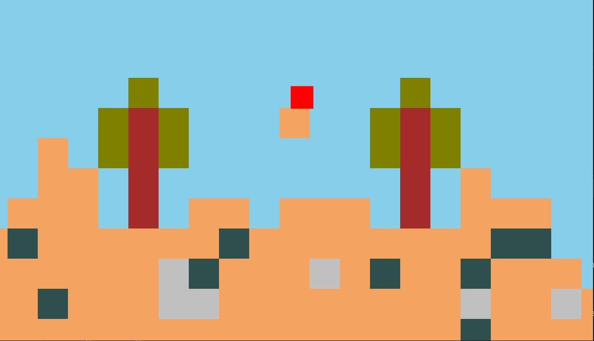

# tile-game
A block-based JavaFX game where the user can break and place blocks in a randomly generated world.

# Execution
Double-click the executable JAR or run `mvn clean javafx:run` from the project folder.

# Controls
Use W, A, and D to move around. 

Left click a block to destroy it and store it in the inventory. Left click an empty(air) block to place a block, if you have at least one block in your inventory.